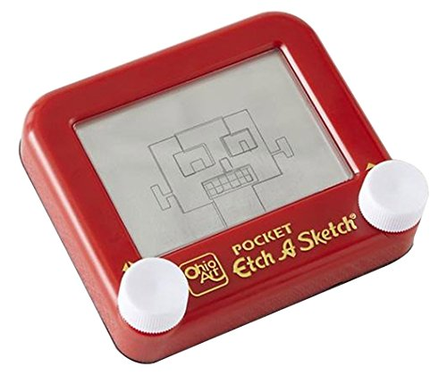

# Etch-a-Sketch Project (I don't know what does that even mean)

- It seems like this thing is something simiar to this (see image). It's like the one that's seen in Toy Story

- So I'm not going to deeply explain this project here, only say that TOP says that this project will consist of doing
something similar to this etch-a-sketch thing, using the DOM of course, and basically that, IDK what else to say. 
Maybe when I finish the project I write a conclusion or maybe I don't. Enjoy (to myself).